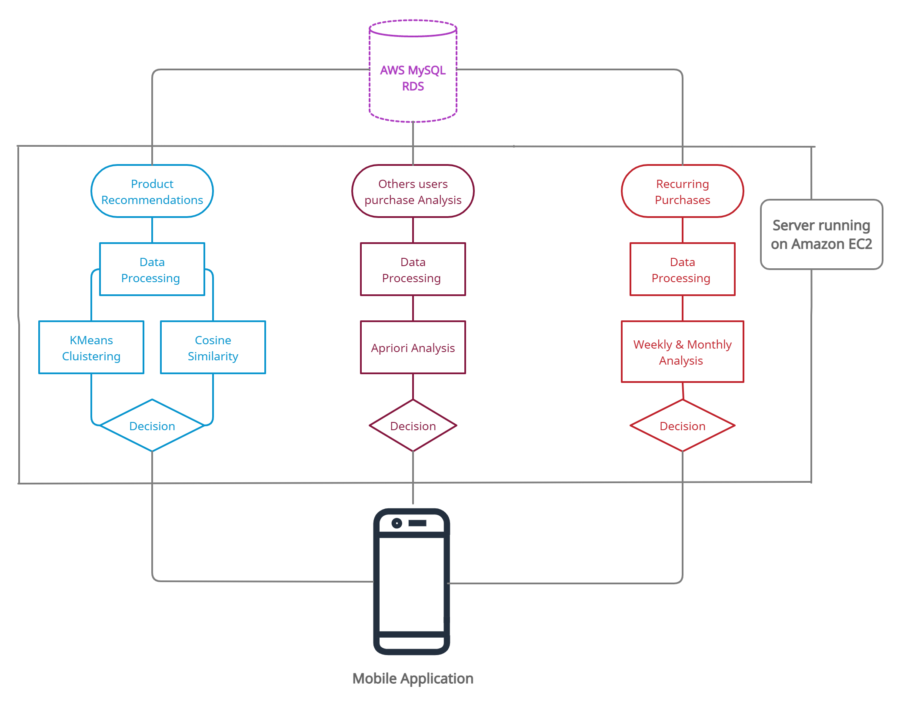
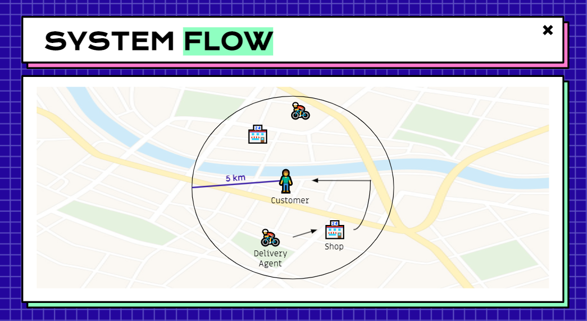
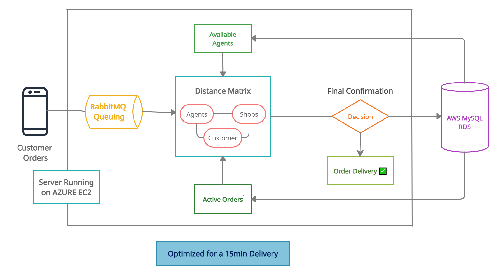

<div align="center"> 
  <p align='center'> 
   
   
   <br>
   
    <br>
   <br>
  </p>
  
  <br><br>
  <p>
  
  </p>
  
  <br><br>
 </div>
 

- [x] Can AI play a role here by predictively analysing the customer order patterns? Can a grocery order be auto-triggered?

  <div align="center"> 
  
  </div>
    
    ```
    We have a 3 way powered recommendation engine that uses content filtering, collaborative
    and past order history based recommendations to suggest the most effective and nearest 
    matching products to the users.
    
    Content based filtering suggests, how products with similar tags are selected and suggested 
    to the user. Care is taken to ensure that tags for multiple products are properly analysed 
    before recommending anything. Collaborative and past order based recommendations are quite 
    similar apart from a few points. Users with a similar order history or similar likes or dislikes
    are suggested near alike products.
    
    Using the apriori algorithm, we can determine patterns and trends in an user’s past orders based
    on pruning frequency and candidate items to improve joining efficiency. This algorithm can also 
    be used to determine recurring orders and send push  notifications to the user for the same.

    ```
    
 
- [x] Can Kiranas play a role in quicker deliveries? If yes, how can it work at scale?
    
  <div align="center"> 
  
  <br>
  
  </div>
  
  ```
  As per the basic flow of the system, first the customer places an order and we get the coordinates of 
  the customer via device location and then scans all the nearest shops and delivery agents in a 5km radius.
  
  Then we will assign the order to the nearest shop and the delivery agent based upon a distance matrix as
  shown above. The shop is selected based on the availability of the product and the number of pending orders 
  in the shop. 
  
  A job is pushed using RabbitMQ and the shopkeeper gets an alert message and has a 2 minute window   to accept
  the order failing which the order will be passed on to the next available shop. After the job is acknowledged 
  it is popped from the queue. Next the delivery agent will receive a job through RabbitMQ. The delivery agent 
  also has to accept the job within 2 minutes or else it will be passed on to the next agent.
  
  Accordingly a final decision is made and the product is delivered

  ```
 
- [x] In Tier-1 cities, our societies are now digitised, courtesy the likes of Mygate. Can this prove to be a fundamental block in achieving higher speed of deliveries? (Relay deliveries)
    
    ```
    We have also incorporated a feature which plays a fundamental role in relay deliveries.  We will ensure that 
    products ordered at same time from nearby localities are ordered to the customers via the same delivery agent 
    therefore keeping the max possible delivery agents available for further orders.
    
    Suppose customer 1 and customer 2 from nearby localities order products at the same time, their orders will be 
    delivered via the nearest same delivery agent. This facilitates relay deliveries and ensures max possible 
    delivery agents are available for further orders.
    ```

 <div align="center"> 
    <p>
    </p>
    
  <br><br>
 </div>

<div align="center"> 
    <p>
    </p>
    
  <br><br>
 </div>


<div align="center"> 
   
</div>
<br>

<div align="center"> 
  <br>
</div>
<br>


 ```
 
 - Python(3.9.6): Poetry for python dependency management
 - Node.js
 - React js
 - React Native
  
 ```
 <br>
 
 <div align="center"> 
   
</div><br>

 ```
 Fork The Repository ✅
 
 $ git clone https://github.com/<username>/Team_Nodemon.git   
```

  ```
 $ cd Team_Nodemon
 ```

#### Start the Python ML backend 🚀 :

   ```
   pip install poetry
   cd ML
   bash install.sh
   bash run.sh
   ```
   
  **OR**
   
   ```
   pip install poetry
   cd ML/Recommendation_sys
   poetry install
   poetry run uvicorn main:app --reload
   ```


#### Start the Server Backend 🗃 :

#### Start the Admin Frontend 🖥️ :

#### Start the Native App 📱 :


<br><br>

<div align="center"> 
   
</div>
  <br>
  
  #### Recommendation System | Backend :
  
  ```
  Python
  - Scikit Learn
  - Pandas
  - NLP
  - Poetry
  - FastAPI
  - Uvicorn
  
  Database
  - MySQL
  
  Deployment
  - AWS
  ```
  
  #### Admin | Frontend
  
  ```
  - React JS
  ```
  
  #### Server | Backend
  
  ```
  - Node JS
  - Express
  - RabbitMQ
    
    Deployment
    - Azure
    
    Open Source APIs
    - https://rapidapi.com/digitallyamar/api/distance-calculator1(Distance Calculating API)

  ```
  
  #### Native | Android
  
  ```
  - React Native
  ```
  <br>

<div align="center"> 
   
</div>
  <br>

    
<div align="center"> 
  <table>
<tr align="center">
 <td>

Atimabh Barunaha

<p align="center">

</p>
<p align="center">
<a href = "https://github.com/Atimabh"></a>
<a href = "https://www.linkedin.com/in/barunaha/">

</a>
</p>
 <strong>Frontend | UI-UX<strong>
</td>
<td>
  
Chetan Pareek

<p align="center">

</p>
<p align="center">
<a href = "https://github.com/cp99says"></a>
<a href = "https://www.linkedin.com/in/cp99says/">

</a>
</p>
  <strong>Backend Developer<strong>
</td>

  <td>
    
Raghav Sharma

<p align="center">

</p>
<p align="center">
<a href = "https://github.com/raghav1299"></a>
<a href = "https://www.linkedin.com/in/raghavsharma1299/">

</a>
</p>
    <strong>Senior Developer<strong>
</td>

  <td>
    
Ram Prakash Reddy

<p align="center">

</p>
<p align="center">
<a href = "https://github.com/ramprakashreddy"></a>
<a href = "https://www.linkedin.com/in/ram1612/">

</a>
</p>
    <strong>App Developer<strong>
</td>

<td>
  
Swarnabha Das

<p align="center">

</p>
<p align="center">
<a href = "https://github.com/sd2001"></a>
<a href = "https://www.linkedin.com/in/swarnabha-das-2001official/">

</a>
</p>
  <strong>ML | Backend<strong>
</td>
  
  </table>
</tr>
</div>
  <br>
  
  
 <!-- END -->

<div align="center">
 <p>
 <br>
   <br>
   <br><strong><Repo-Name></strong>This Repository is available under MIT License, read the LICENSE file for more info
  <p>
 </div>
   
 <div align="center">
  
 </div>

